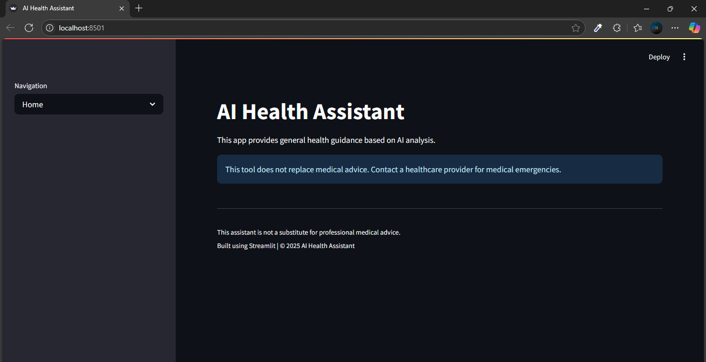

# AI Health Assistant

An AI-powered Streamlit web app to help users analyze symptoms, track health risks, and get personalized health recommendations using a smart, interactive UI.

[](https://ai-powered-health-assistant-bsfx727zjagso4egraxe3y.streamlit.app/)


---

## 🌟 Features

- 🔍 AI-powered health symptom analysis
- 📊 Risk level detection (Low, Moderate, High)
- 📈 Health dashboard with trends and insights
- 👤 Profile management (age, gender, conditions)
- 📚 Educational health resources
- 💡 Lifestyle tips and recommendations

---

## 📦 Tech Stack

[](https://streamlit.io)  
[](https://www.python.org)  
[](https://pandas.pydata.org/)  
[](https://plotly.com)  
[](#)
> 💡 *Future integration possible with OpenAI/GPT APIs for enhanced health analysis.*
---

## ⚙️ Setup Instructions (Run Locally)

### 1. Clone the Repository

```bash
git clone https://github.com/your-username/ai-health-assistant.git
cd ai-health-assistant
```

### 2. Create a Virtual Environment (Optional)

```bash
python -m venv venv
source venv/bin/activate   # On Windows: venv\Scripts\activate
```

### 3. Install Dependencies

```bash
pip install -r requirements.txt
```

### 4. Run the App

```bash
streamlit run app.py
```

The app will open in your browser at [http://localhost:8501](http://localhost:8501)

---

---

## 📸 App Preview




---

## ☁️ Deployment Options

### 🚀 Deploy on Streamlit Cloud (Recommended)

1. Push your project to GitHub
2. Visit: [https://streamlit.io/cloud](https://streamlit.io/cloud)
3. Click **"New app"**
4. Choose your repo and `app.py`
5. Click **Deploy**

🔗 You’ll get a public URL like:  
**https://ai-powered-health-assistant-bsfx727zjagso4egraxe3y.streamlit.app/**

---

## ⚠️ Disclaimer

> **This application is for informational and educational purposes only.**  
> It is not a substitute for professional medical advice, diagnosis, or treatment.  
> Always consult a qualified healthcare provider for medical concerns.

---

### 💖 Built With

[](https://streamlit.io)  
[](https://www.python.org)  
[](https://plotly.com)

